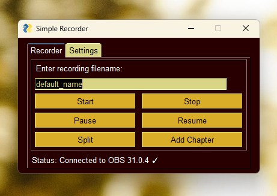

# simple-recorder

A single purpose application for naming a file recording in OBS.

Run it as a CLI or a GUI.

## Requirements

-   Python 3.11 or greater

## Installation

*with uv*

```console
uv tool install simple-recorder
```

*with pipx*

```console
pipx install simple-recorder
```

## Use

Without passing a subcommand (start/stop) a GUI will be launched, otherwise a CLI will be launched.

### GUI



Just enter the filename and click *Start Recording*.

### CLI

```shell
Usage: simple-recorder [OPTIONS] COMMAND

┏━ Subcommands ━━━━━━━━━━━━━━━━━━━━━━━━━━━━━━━━━━━━━━━━━━━━━━━━━━━━━━━━━━━━━━━━┓
┃ start  Start recording                                                       ┃
┃ stop   Stop recording                                                        ┃
┗━━━━━━━━━━━━━━━━━━━━━━━━━━━━━━━━━━━━━━━━━━━━━━━━━━━━━━━━━━━━━━━━━━━━━━━━━━━━━━┛

┏━ Options ━━━━━━━━━━━━━━━━━━━━━━━━━━━━━━━━━━━━━━━━━━━━━━━━━━━━━━━━━━━━━━━━━━━━┓
┃ --host <HOST>                                                                ┃
┃ --port <PORT>                                                                ┃
┃ --password <PASSWORD>                                                        ┃
┃ --theme <THEME>                                                              ┃
┗━━━━━━━━━━━━━━━━━━━━━━━━━━━━━━━━━━━━━━━━━━━━━━━━━━━━━━━━━━━━━━━━━━━━━━━━━━━━━━┛
```

```console
simple-recorder start "File Name"

simple-recorder stop
```

If no filename is passed to start then you will be prompted for one. A default_name will be used if none is supplied to the prompt.
